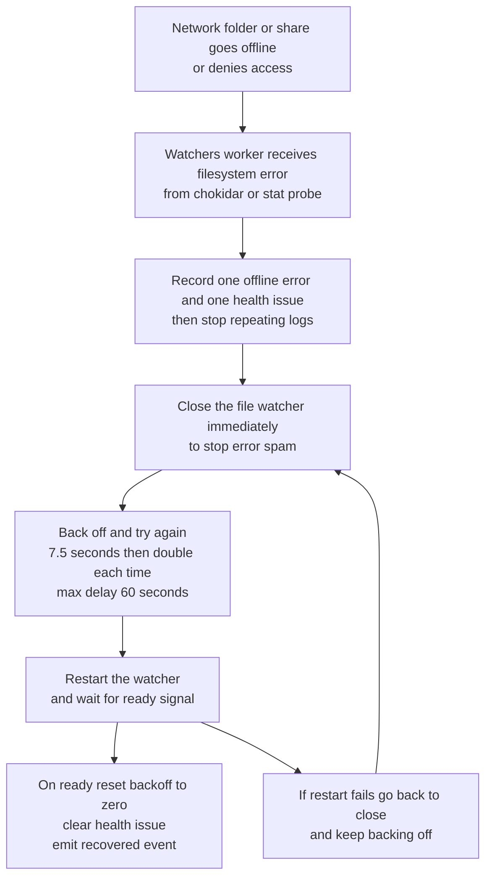

# AGENTS.md — Coding Agent Rules & Orientation
## Woodtron CNC Job Management Platform

This document defines **how any coding agent (AI or human)** must work on this repository.

The goals are:
- Safe, predictable changes
- Clear explanations for a beginner developer
- Zero accidental data-flow, CNC, or production breakage
- No “magic” or silent behavior

If you are an agent working on this repo, **you are expected to read and follow this file fully**.

---

## 0) Absolute Rules (Non-Negotiable)

### 0.1 Ask clarifying questions if anything is ambiguous
If you are not 100% sure what the user wants, **stop and ask questions before writing code**.

Examples:
- Which machine(s) does this apply to?
- Is the source of truth the filesystem, the database, or both?
- Is this for Nestpick, Grundner, AutoPAC, or general CNC jobs?
- Is this UI-only, or does it affect watchers / job state?
- What is the expected “done” behavior?
- DO NOT ASK WHERE SPECIFIC CODE IS. IT IS YOUR JOB TO GO AND FIND WHERE THE RELIVANT CODE IS.

**Never guess. Never assume.**

---

### 0.2 Beginner-friendly explanations are mandatory
Assume the repo owner is **new to TypeScript, Electron, and web development**.

After making changes, you must:
- Explain *what changed* and *why*
- Explain *what new variables are*, what type they are, and what they store
- Explain the flow in plain English (who calls who, and when)
- Avoid jargon — or define it once clearly

---

### 0.4 Data-flow changes REQUIRE a mind map
If your change alters:
- IPC request/response shape
- Database write paths
- Job lifecycle transitions
- Watcher behavior
- File movement rules

You **must** include a data-flow explanation:
- Mermaid diagram **or**
- Clear before/after flow bullets

(Templates are provided later in this document.)

---

### 0.5 Git rule — extremely important 🚨
**NO AGENT IS ALLOWED TO PERFORM A `git commit` WITHOUT EXPLICIT USER CONSENT.**

- You may:
  - Edit files
  - Suggest commits
  - Provide commit messages
- You may **NOT**:
  - Commit
  - Push
  - Amend history
  - Create branches

Unless the user explicitly says:  
> “Go ahead and commit this”

---

### 0.6 Electron security is sacred
Do **not** weaken security settings.

- `contextIsolation` must remain `true`
- `nodeIntegration` must remain `false` in the renderer
- Never expose raw Node/Electron APIs to the UI
- Only expose safe, minimal functions via `window.api`

---

## 1) What this software does (high-level)

This is an **Electron desktop application** used in real CNC workshops to manage:

- Multiple CNC machines
- Job ingestion and lifecycle tracking
- NC file staging and validation
- AutoPAC CSV-driven status updates
- Nestpick integration (sheet picking)
- Grundner integration (robotic load/unload)
- Telemetry visualization (from an external collector)
- Local authentication and user roles
- PostgreSQL as the local system-of-record

**Important:**  
The UI never talks directly to CNC machines or network shares.  
All privileged operations live in the Electron **Main** process.

---

## 2) Glossary (domain + tech)

| Term | Meaning |
|-----|--------|
| CNC | Computer Numerical Control machine |
| NC File | G-code file executed by a CNC |
| Nestpick | Automated sheet picking / stacking system |
| Grundner | Robotic CNC loading/unloading system |
| AutoPAC | CNC controller producing CSV job status |
| MES | Manufacturing Execution System |
| IPC | Inter-Process Communication (Electron) |
| Renderer | Browser-like UI process |
| Main | Node.js backend process |
| Preload | Secure bridge between UI and Main |

---

## 3) Electron architecture (mental model)

Electron has **three processes**:

### 3.1 Renderer
- React UI (Vite + Tailwind)
- No filesystem, no DB, no Node APIs
- Talks ONLY via `window.api`

### 3.2 Preload
- Secure bridge
- Defines what the UI is allowed to call
- Translates UI calls → IPC messages
- No business logic

### 3.3 Main
- All real logic lives here:
  - File IO
  - Database access
  - Watchers
  - Integrations
  - Job lifecycle enforcement

**Rule:**  
If the UI needs something privileged → it goes Renderer → Preload → Main.

---

## 4) Repo layout (full map)

```text
.
├── docs/                     # Human-readable documentation
├── packages/
│   ├── main/                 # Electron Main process
│   │   ├── ipc/              # IPC handlers (thin)
│   │   ├── services/         # Business logic
│   │   ├── repo/             # Database access
│   │   ├── workers/          # File watchers (background)
│   │   └── util/             # Shared helpers
│   ├── preload/              # window.api definitions
│   ├── renderer/             # React UI
│   └── shared/               # Shared types + schemas
├── tests/                    # Vitest tests
├── electron-builder.yml      # Packaging config
└── package.json              # Root scripts
````

---

## 5) Development commands (PowerShell)

Run from repo root unless stated.

### Install dependencies

```powershell
pnpm install
```

### Run app (standard dev)

```powershell
pnpm dev
```

### Run NC-Catalyst embedded mode

```powershell
pnpm nc
```

### Tests

```powershell
pnpm exec vitest
```

### Formatting

```powershell
pnpm format
pnpm format:check
```

### Search code

```powershell
rg "nestpick"
Select-String -Path .\packages\**\*.ts -Pattern "watcher"
```

---

## 6) Job lifecycle (critical domain logic)

Jobs move through constrained states.
Do **not** bypass or invent transitions without updating enforcement logic and docs.

```text
PENDING
  → STAGED
  → LOAD_FINISH
  → LABEL_FINISH
  → CNC_FINISH
  → FORWARDED_TO_NESTPICK
  → NESTPICK_COMPLETE
```

Rules:

* Filesystem + CSV events drive transitions
* Watchers must be **idempotent**
* DB writes must be safe to repeat
* Network shares may be slow, locked, or temporarily unavailable

---

## 7) Configuration & source of truth

### settings.json

* Loaded by Main
* Validated with schemas
* Stored in Electron `userData` unless overridden

Key settings include:

* `processedJobsRoot`
* `machines[].apJobfolder`
* `machines[].nestpickFolder`
* `machines[].nestpickEnabled`
* `machines[].pcIp`

If a job “does nothing”, **check these first**.

---

## 8) Result Envelope (error handling rule)

IPC responses must follow this shape:

```ts
{ ok: true, value: T }
{ ok: false, error: { message: string; code?: string; details?: unknown } }
```

* Do not throw raw errors across IPC
* Renderer must handle both cases

---

## 9) Required data-flow mind map templates

### Mermaid example

* Strictly no () in the mermaid chart. This is a syntax error if used.


### Mermaid style rules for this repo

Goal: A beginner developer or operator should be able to read the diagram and understand the logic.
Use descriptive labels that explain what happens, not just component names.

Rules:

* Default direction is top down using `flowchart TD`.
* Node ids should be short and stable (example: `FS`, `WK`, `DB`).
* Node labels (inside `[]`) must describe what the step does in plain English.
  * Include key numbers and limits in the label when relevant (example: `7.5 seconds`, `double each time`, `max delay 60 seconds`).
* Use simple arrows `A --> B` unless edge labels add real clarity.
* Strictly no parentheses characters in Mermaid text. Mermaid syntax errors on this repo when `()` appear.
* Use `<br/>` inside node labels to force line breaks.
  * This prevents labels getting cut off in the UI.
  * Prefer 2 to 3 lines per node when possible.
* Use Settings UI names, not internal variable names.
  * Example: write `AutoPAC CSV Directory` instead of `autoPacCsvDir`.
* When referring to files, always use the literal file name.
  * Example: write `order_saw.csv` not "order saw".
* Avoid jargon and acronyms in labels unless the term is already defined nearby.

Example watcher self heal backoff flow:



### Before / After explanation

You must explain:

* What changed
* Why it changed
* What stayed the same
* New failure modes (if any)

---

## 10) Testing expectations

* Tests live under `tests/`
* Electron is mocked
* Coverage is intentionally low (early stage)

**Do not reduce coverage.**

If you touch:

* IPC
* Repos
* Services
* Watchers

→ tests should be run.

---

## 11) Version control rules

* Agents **must never commit** without explicit permission
* Agents may suggest commit messages
* Agents may prepare diffs
* User always controls git history

---

## 12) How to report work back to the user

Every response after code changes must include:

1. What changed
2. Why it changed
3. How to test it
4. Variable/type explanations
5. Data-flow mind map (if applicable)
6. Any risks or follow-ups

---

## 13) Agent behavioral checklist

Before saying “done”, confirm:

* ✅ Clarifying questions asked if needed
* ✅ Beginner-friendly explanations provided
* ✅ Tests run (if applicable)
* ✅ No security regressions
* ✅ No git commits made
* ✅ Docs updated if behavior changed

---

**This file is the contract.
Breaking these rules is considered a failure.**


