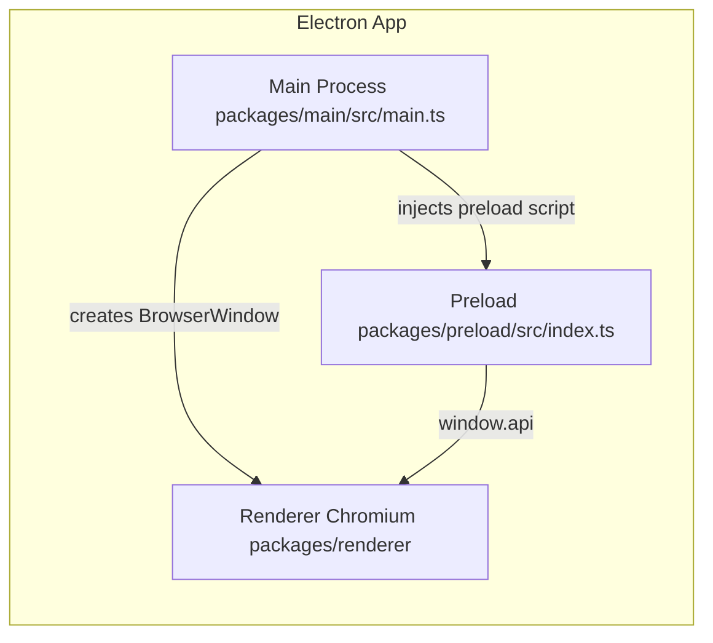
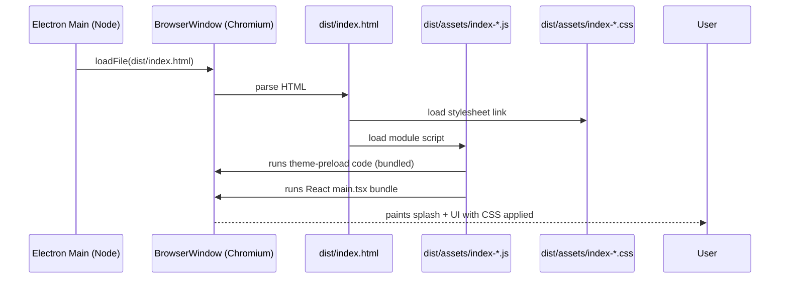
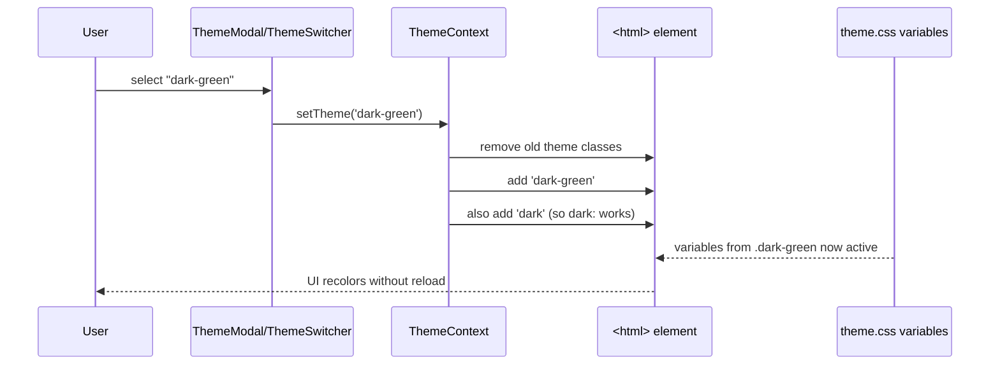

You can absolutely get to a place where “I see a red, I know exactly where it comes from” — but right now this repo is in an in-between state where multiple styling approaches are mixed, and a few key “design token” pieces are either missing or not actually wired into Tailwind the way the code expects.

I’m going to treat this like a mini training course using *your* repo as the example.

**1) First: What You’re Actually Running (Electron = 3 apps in one)**

In Electron, you have 3 distinct “worlds”:

- **Main process (Node.js)**: controls windows, file system, IPC, background work.
- **Preload script (bridge)**: a safe “API layer” injected into the browser so the renderer can call into Electron without having full Node access.
- **Renderer (Chromium browser)**: this is a web app (HTML/CSS/JS) running inside Electron.

In your repo:

- Main process entry: `packages/main/src/main.ts`
- Renderer entry HTML: `packages/renderer/index.html`
- Renderer entry JS (React): `packages/renderer/src/main.tsx`
- Renderer CSS entry: `packages/renderer/src/index.css`
- Theme tokens: `packages/renderer/src/styles/theme.css`

Mermaid overview:



**2) Web Basics (Beginner-friendly)**

**HTML**
- The *structure* of a page.
- Think: “the skeleton / layout of elements”.

**CSS**
- The *styling rules* for the page: colors, spacing, layout, fonts.
- Think: “paint + positioning”.

**A stylesheet**
- A file of CSS rules, usually `.css`.
- Example: `packages/renderer/src/index.css` is a stylesheet.

**JavaScript**
- The code that makes the UI interactive.
- In React, you don’t usually hand-write HTML; JavaScript generates it.

**React**
- A JavaScript library that renders UI by building DOM elements.
- In React you write JSX/TSX which *looks like HTML*, but is actually JS/TS code.

**Tailwind**
- A library that generates lots of tiny CSS classes like `bg-red-500`, `p-4`, `flex`, etc.
- You use Tailwind by putting those classes on elements.

**3) The Most Important Concept: “CSS Cascade” (Why colors “override”)**

When the browser decides the final color of something, it uses:

- **Specificity**: more specific selectors win (e.g. `#id` beats `.class`)
- **Order**: if specificity is equal, the rule that appears later wins
- **Inline styles**: `style="..."` usually wins over stylesheet rules
- **Layers** (`@layer`): Tailwind uses CSS Layers so the order is predictable

This is why you can feel like “I set red here, but it’s overridden somewhere else”.

**4) How Your Renderer Actually Boots and Loads Styles**

There are two relevant phases: **dev** and **production build**.

### 4.1 Production runtime (what shipped Electron uses)

Main process does this:

- `packages/main/src/main.ts`:
  - In dev: `win.loadURL(process.env.VITE_DEV_SERVER_URL)`
  - In prod: `win.loadFile(join(__dirname, '../../renderer/dist/index.html'))`

So in production, the renderer starts at:

- `packages/renderer/dist/index.html`

That file includes:
- A built JS bundle
- A built CSS file

Example (your current built output changes names each build):
- `packages/renderer/dist/index.html` references `packages/renderer/dist/assets/index-a-Vopiiy.css`

Mermaid timeline:



### 4.2 Dev runtime (when running Vite)

- `packages/renderer/index.html` is served by Vite.
- It includes:
  - `./src/theme-preload.ts`
  - `./src/main.tsx`

File: `packages/renderer/index.html`

```html
<script type="module" src="./src/theme-preload.ts"></script>
<script type="module" src="./src/main.tsx"></script>
```

So **theme-preload runs before React mounts** to prevent “flash of wrong theme”.

**5) How Themes Work in Your Repo (The real mechanism)**

You have **two “theme application” layers**:

1) Pre-mount theme application:
- `packages/renderer/src/theme-preload.ts`
- Runs before React renders
- Reads localStorage key `woodtron-theme`
- Adds/removes theme classes on `<html>`

2) Runtime theme application:
- `packages/renderer/src/contexts/ThemeContext.tsx`
- Runs after React mounts
- Keeps `<html>` class in sync with app state
- Saves theme back to localStorage

### Theme classes used
From `ThemeContext.tsx`:
- `'light' | 'sunset' | 'dark-teal' | 'dark-green' | 'dark-charcoal'`

**Key detail (very important):**
- For any dark theme (`dark-teal`, `dark-green`, `dark-charcoal`), you end up with **two classes**:
  - the theme class
  - plus `dark` (so Tailwind `dark:` variant works)

That behavior is in:
- `packages/renderer/src/theme-preload.ts`
- `packages/renderer/src/contexts/ThemeContext.tsx`

Theme flow:



**6) What CSS Files Are Actually Loaded**

This is surprisingly simple:

- `packages/renderer/src/main.tsx` imports `./index.css`
- `packages/renderer/src/index.css` imports:
  - `@import './styles/theme.css';`
  - `@import 'tailwindcss';`

So the only “real” source stylesheets are:
- `packages/renderer/src/styles/theme.css` (theme variables)
- `packages/renderer/src/index.css` (global + component CSS)
- Tailwind (generated CSS from the Tailwind compiler)

In production, these get bundled into one final CSS asset:
- `packages/renderer/dist/assets/index-*.css`

**7) The Two Ways Your Repo Applies Colors (and why it’s confusing)**

You currently use both:

A) **CSS variables (theme tokens)**  
Example usage in JSX:
- `bg-[var(--card)]`
- `text-[var(--foreground)]`
- `border-[var(--border)]`
- `bg-[var(--status-error-bg)]`

Where variables are defined:
- `packages/renderer/src/styles/theme.css`

Pros:
- Fully themeable (dark-teal/dark-green/dark-charcoal/sunset/etc)
- One place to change colors

Cons:
- Easy to reference a variable that doesn’t exist (silent failure)
- Bracket syntax is noisy and harder to read

B) **Hardcoded Tailwind palette colors**  
Example usage:
- `bg-red-500/25 dark:bg-red-400/20`
- `text-red-700 dark:text-red-300`

Pros:
- Very explicit, predictable “light vs dark”
- Doesn’t depend on your theme variables

Cons:
- Ignores dark-* / sunset palettes (only light vs dark)
- You must update every place manually if you want consistency

**8) A Very Important Audit Finding: Some “systems” in the repo are not actually active**

This is likely the #1 source of “where is this color coming from / why didn’t it work?”

### 8.1 Tailwind “semantic tokens” look like they should exist, but don’t appear in built CSS

Your codebase uses classes like:
- `bg-card`
- `text-foreground`
- `bg-background`
- `border-border`

Those are typically generated when Tailwind is configured with theme tokens (either via `tailwind.config.ts` or Tailwind v4 CSS-first `@theme`).

You have a Tailwind config file:
- `packages/renderer/tailwind.config.ts`

BUT when I inspected your compiled CSS output:
- `packages/renderer/dist/assets/index-a-Vopiiy.css`

I could not find selectors like:
- `bg-card`
- `bg-background`
- `text-foreground`
- `border-border`

Yet those class strings *do* exist in the compiled JS bundle:
- `packages/renderer/dist/assets/index-D95dpb_d.js`

Meaning: the elements have the class names, but the CSS rules for them are not present, so they do nothing.

That strongly suggests one of these is true:
- Tailwind is not loading `packages/renderer/tailwind.config.ts` for your build, OR
- Tailwind v4 config is expected to be CSS-first (via `@theme` / `@config`), and the tokens are not defined.

Practical implication:
- Some classes you see in JSX might not style anything at all.
- That’s *very* hard to debug as a beginner, because it looks valid but has no effect.

### 8.2 Missing CSS variables referenced in code

These are referenced, but not defined in `packages/renderer/src/styles/theme.css`:

- `--input-bg` (used in `packages/renderer/src/shell/AppLayout.tsx`)
- `--shadow-sm`, `--shadow-blue-sm`, `--shadow-blue-md` (used in `packages/renderer/src/index.css`)
- `--shadow-soft`, `--shadow-medium` (used in `packages/renderer/src/components/ui/card.tsx`)
- `--transition-normal` (used in `packages/renderer/src/index.css`)

When a variable is missing, you get “silent fallback” behavior:
- The CSS rule becomes invalid *or* resolves to nothing useful
- The browser falls back to another rule (which feels like “it got overridden”)

**9) Why mixing theme variables + Tailwind palette becomes hard to track**

Example:
- One component uses `bg-[var(--status-error-bg)]` (theme controlled)
- Another uses `bg-red-500/25 dark:bg-red-400/20` (Tailwind palette controlled)

Now “error red” is not one thing.
It’s two unrelated systems.

So when you ask “where do I change error red?” the answer becomes: “depends which component you’re talking about”.

That’s exactly the pain you’re describing.

**10) How to Trace “Where did this color come from?” (step-by-step)**

Do this in Electron (Chromium devtools):

1) Right-click the element → Inspect
2) In the **Styles** panel:
- Find the property (like `background-color`)
- You will see the rule and the source file (or `<style>` tag)
3) If you see:
- `background-color: rgb(...)` coming from `.bg-red-500/25`  
  -> it’s a Tailwind palette class
- `background-color: var(--status-error-bg)`  
  -> it’s a theme variable (go to `packages/renderer/src/styles/theme.css`)
- nothing applied even though class exists  
  -> that class likely has no CSS rule generated

To inspect variable values directly, open Console and run:
- `getComputedStyle(document.documentElement).getPropertyValue('--status-error-bg')`

**11) Best Practices (what I’d do to make this easy to maintain)**

You basically need to pick one “source of truth” for colors:

Option 1 (Best if you truly want multiple themes like dark-teal/dark-green/dark-charcoal/sunset):
- Use **CSS variables as tokens**
- Use Tailwind only as a “syntax” to apply tokens (prefer semantic names)
- Avoid Tailwind palette colors for semantics (error/success/warning)

Rules:
- “Error color” must always come from one token, e.g. `--status-error-*`
- Buttons should use `bg-destructive` where destructive is token-driven (not hardcoded `bg-red-600`)
- Define all tokens you reference (no silent fallbacks)

Option 2 (Best if you only care about light vs dark, and themes are basically “skins”):
- Use Tailwind palette + `dark:` for status colors
- Accept that dark-green/dark-charcoal won’t fully control status colors
- Still keep CSS variables for surfaces (background/card/border)

Rules:
- “Error red” is always `red-*` classes with `dark:` pairs
- Theme variables control layout/surfaces, not semantic status colors

Right now, you’re in a mixed state: some things are Option 1, some are Option 2.

**12) What I Recommend Next (to turn this into a clean, beginner-friendly system)**

If your goal is “easy to track”:

1) Fix the “semantic Tailwind tokens” pipeline first
- Either make `tailwind.config.ts` actually apply during build, OR
- Move to Tailwind v4 CSS-first theming (`@theme`, `@config`) and delete/stop relying on config tokens

2) Define or remove missing tokens
- Add definitions for `--input-bg`, shadow tokens, transition tokens (or stop using them)

3) Pick ONE semantic color approach for statuses
- Either all `--status-error-*` tokens
- Or all Tailwind palette `red-*` with `dark:`

4) Update component primitives to match the system
- `packages/renderer/src/components/ui/button.tsx` currently hardcodes red/blue; that fights token theming.

**13) One more thing: You already have a styling guide doc, but it doesn’t match the code**
There’s a repo doc:
- `docs/STYLING.md`

It contains useful concepts, but it’s out of date relative to your current theme names and token usage (it references themes/classes/tokens that don’t exist anymore, like `.modern`, and claims `.bg-card` utilities exist).

This mismatch alone can make everything feel impossible as a beginner.

If you want, I can:
- Produce an updated “STYLING.md v2” outline (still read-only right now)
- And then once you’re out of plan mode, we can actually update the doc to match reality.

**One question (because it determines the best long-term direction):**
Do you want your semantic colors (error/warning/success) to follow *each theme* (dark-teal vs dark-green vs dark-charcoal vs sunset), or is “light vs dark only” acceptable for semantic colors across the app?

- If you answer “follow each theme”: we should standardize on CSS tokens (`--status-error-*`) everywhere and stop using `bg-red-*` for semantics.
- If you answer “light vs dark only”: we should standardize on Tailwind palette + `dark:` for semantics and stop trying to theme status colors via variables.

Either choice can be made clean and beginner-friendly — the hard part is mixing them.
