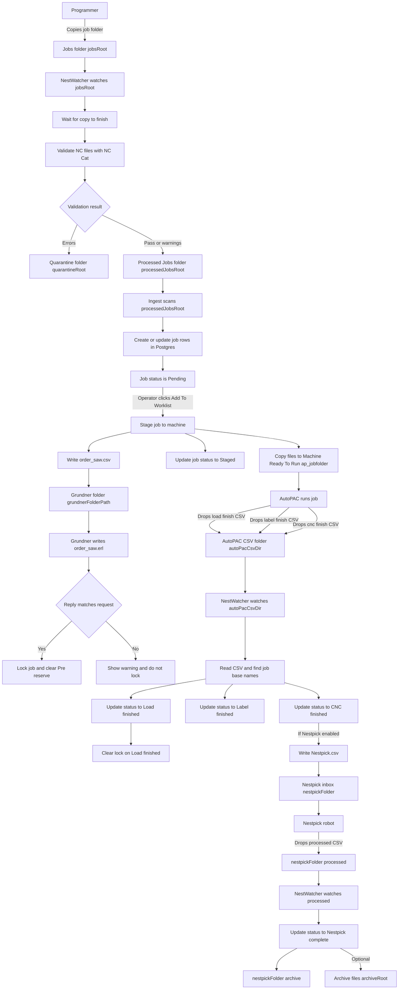

# Job Processing Flow

Quick reference for how jobs move through the system from ingestion to completion.

## Flow Diagram

This is the "whiteboard" version: folders, files, watchers, and status updates.



## Folder and setting names

These are the path settings that drive the job flow:

- `jobsRoot` is where jobs are dropped first for validation.
- `processedJobsRoot` is where validated jobs live and where ingestion happens.
- `quarantineRoot` is where jobs with validation errors are moved.
- `autoPacCsvDir` is where AutoPAC drops status CSVs.
- `grundnerFolderPath` is where NestWatcher drops and reads Grundner request and reply files.
- `archiveRoot` is where completed jobs can be archived.
- `machines[].apJobfolder` is the per machine Ready To Run folder.
- `machines[].nestpickFolder` is the per machine Nestpick folder.

## Job key format

Every job has a stable string key stored in `public.jobs.key`.

In the current code, the key is built like this:

- Take the folder that contains the `.nc` file.
- Compute its path relative to `processedJobsRoot`.
- Take the NC file name without the `.nc` extension.
- Combine them as `relativeFolder/baseName`.

Example:
- File on disk: `processedJobsRoot\\Kitchen\\Run1\\ABC123.nc`
- Key becomes: `Kitchen/Run1/ABC123`

This key is what links everything together: watchers, job events, and MES metrics.

## Status and what causes it

Job status is stored in Postgres in `public.jobs.status`.

- `PENDING` is created by ingestion when a job exists in `processedJobsRoot`.
- `STAGED` is set when an operator stages the job to a machine.
- `LOAD_FINISH`, `LABEL_FINISH`, `CNC_FINISH` come from AutoPAC CSV files.
- `FORWARDED_TO_NESTPICK` is set when NestWatcher successfully writes `Nestpick.csv`.
- `NESTPICK_COMPLETE` is set when NestWatcher processes a CSV in `nestpickFolder/processed`.

## File Structure Requirements

### 0. Intake validation

**Location**: `jobsRoot`

**What happens here**:
- A watcher in `watchersWorker.ts` detects new `.nc` files under `jobsRoot`.
- NestWatcher validates all NC files in the folder using NC Cat.
- If there are validation errors, the folder is moved to `quarantineRoot`.
- Otherwise, the folder is moved to `processedJobsRoot`.

### 1. Ingestion and Pending jobs

**Location**: `processedJobsRoot` (configured in Settings)

**Structure**:

```
processedJobsRoot/
  JobFolderName/
    JobName.nc        required
    JobName.lpt       optional
    JobName.pts       optional
    JobName.csv       optional
    RJT.csv           optional
    images            optional
```

**Metadata extracted from the NC file**
- `ID=<material>` becomes the `material` field.
- `G100 X<x> Y<y> Z<z>` becomes:
  - `size` stored as `XxY`
  - `thickness` stored as `Z`
- `parts` count is derived from `.lpt` or `.pts` line count.

**Important behavior**
- Ingestion creates/updates jobs in the database, but does not pre-reserve stock.

### 2. Staging to a machine

**Trigger**: Operator clicks "Add To Worklist" in the Jobs page.

**Destination**: Machine `ap_jobfolder`.

**What happens**:
- NestWatcher re validates the job again using the selected machine profile.
  - If validation errors exist, staging is blocked.
- Files are copied to the machine Ready To Run folder.
- Job lifecycle is updated to `STAGED`.
- NestWatcher drops `order_saw.csv` into the Grundner folder and waits for an `.erl` confirmation.
  - If confirmed, it locks the job.
  - The number of reserved sheets is sourced from Grundner's `stock.csv` (`reserved_stock`).

### 3. AutoPAC status CSVs

**Location**: `autoPacCsvDir` (configured in Settings)

**File naming**
- `load_finish<machine>.csv`
- `label_finish<machine>.csv`
- `cnc_finish<machine>.csv`

**What happens**
- The watcher reads the CSV, verifies the machine token matches the filename, then extracts base job names.
- For each job name, it updates the matching job status.
- On success the CSV is deleted.

### 4. Nestpick forwarding and completion

- When a job hits `CNC_FINISH` and the machine has Nestpick enabled:
  - NestWatcher finds the staged parts CSV.
  - Rewrites it into `Nestpick.csv` inside `machine.nestpickFolder`.
  - Updates status to `FORWARDED_TO_NESTPICK`.
- Nestpick produces processed CSVs.
  - NestWatcher watches `machine.nestpickFolder/processed`.
  - When a CSV arrives, jobs inside are updated to `NESTPICK_COMPLETE`.
  - The processed CSV is moved into `machine.nestpickFolder/archive`.

## Status transitions

Allowed transitions are enforced in `packages/main/src/repo/jobsRepo.ts`.
