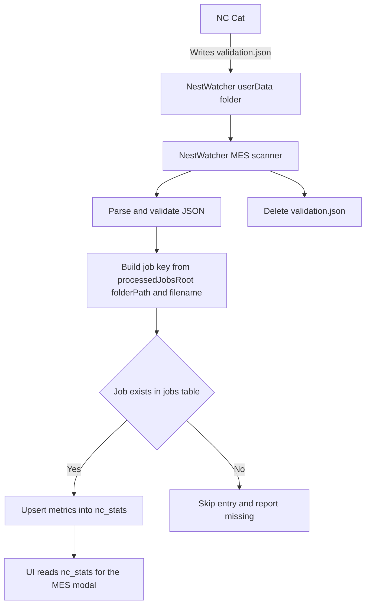

# MES JSON Export Specification

**Version:** 1.1.1
**Last Updated:** December 2024

## Overview

The MES (Manufacturing Execution System) JSON export provides comprehensive data about processed NC files for integration with external manufacturing systems. This document describes each field in the export format.

## How NestWatcher consumes `validation.json`

In this repo, NestWatcher imports MES metrics from a `validation.json` file.

- **Where the file is expected**: NestWatcher looks for `validation.json` inside Electron `userData`.
- **How it links back to jobs**: It only trusts entries that point inside `processedJobsRoot` and turns each entry into a `job key` using the folder path plus NC filename.
- **What gets updated**: It upserts a row in `public.nc_stats` keyed by `jobKey`.
- **Cleanup**: The file is deleted after processing.



A matching `.mmd` copy exists in `docs/charts/MES-JSON-SPECIFICATION.mmd`.

---

## Top-Level Structure

```json
{
  "exportMetadata": { ... },
  "files": [ ... ]
}
```

| Field | Type | Description |
|-------|------|-------------|
| `exportMetadata` | Object | Information about the export itself |
| `files` | Array | Array of processed NC file data |

---

## Export Metadata

The `exportMetadata` object contains information about when and how the export was created.

```json
"exportMetadata": {
  "exportDate": "2024-12-01T10:30:00.000Z",
  "exportedBy": "NC Catalyst",
  "mesOutputVersion": "1.1.1",
  "folderName": "JobFolder123",
  "Status": "pass",
  "originalFolderPath": "/path/to/original",
  "newFolderPath": "/path/to/new"
}
```

| Field | Type | Description |
|-------|------|-------------|
| `exportDate` | String | ISO 8601 timestamp when the export was created |
| `exportedBy` | String | Application that generated the export (always "NC Catalyst") |
| `mesOutputVersion` | String | Version of the MES JSON format (currently "1.1.1") |
| `folderName` | String | Name of the job folder (placeholder for future service) |
| `Status` | String | Overall status: `"pass"` if all files have no issues, `"fail"` if any file has validation errors, warnings, syntax issues, or NestPick failures |
| `originalFolderPath` | String | Original folder location (placeholder for future service) |
| `newFolderPath` | String | New folder location after processing (placeholder for future service) |

### Status Logic

The `Status` field is set to `"fail"` if ANY of the following conditions exist in ANY file:
- Validation errors
- Validation warnings
- Syntax issues
- NestPick failed parts
- Parts too large for pallet

Otherwise, `Status` is `"pass"`.

---

## File Object

Each entry in the `files` array represents one processed NC file.

### Basic Information

```json
{
  "filename": "Panel_001.nc",
  "folderName": "JobFolder123",
  "folderPath": "C:/Jobs/JobFolder123"
}
```

| Field | Type | Description |
|-------|------|-------------|
| `filename` | String | Name of the NC file |
| `folderName` | String | Name of the containing folder (extracted from path) |
| `folderPath` | String | Full path to the folder containing the file |

---

### Material Information

```json
"material": {
  "typeNumber": "12345",
  "name": "16mm Laminate Seasoned Oak",
  "sheetSize": { "x": 2800, "y": 1200, "z": 18 }
}
```

| Field | Type | Unit | Description |
|-------|------|------|-------------|
| `typeNumber` | String | - | Material type identifier extracted from `//TypeNumber=*;` comment in NC file. `null` if not found. |
| `name` | String | - | Material name extracted from `//ID=*;` comment in NC file. Falls back to dimensions if not found. |
| `sheetSize.x` | Number | mm | Sheet width (X dimension) |
| `sheetSize.y` | Number | mm | Sheet height (Y dimension) |
| `sheetSize.z` | Number | mm | Sheet thickness (Z dimension) |

---

### Runtime and Production

```json
{
  "ncRuntime": 245.67,
  "sheetLoadTime": 60,
  "partCount": 12,
  "yieldPercentage": 87.34
}
```

| Field | Type | Unit | Description |
|-------|------|------|-------------|
| `ncRuntime` | Number | seconds | Estimated machining time for the NC program (2 decimal places) |
| `sheetLoadTime` | Number | seconds | Fixed time allocated for loading a sheet onto the CNC machine (configurable in settings, default 60) |
| `partCount` | Number | - | Total number of parts detected in the nest |
| `yieldPercentage` | Number | % | Percentage of sheet area utilized by parts (2 decimal places) |

---

### Offcuts and Waste

```json
{
  "usableOffcuts": [
    { "x": 500, "y": 300, "z": 18 }
  ],
  "wasteOffcutM2": 0.4523
}
```

| Field | Type | Unit | Description |
|-------|------|------|-------------|
| `usableOffcuts` | Array | - | Array of usable offcut pieces (placeholder for future implementation) |
| `usableOffcuts[].x` | Number | mm | Offcut width |
| `usableOffcuts[].y` | Number | mm | Offcut height |
| `usableOffcuts[].z` | Number | mm | Offcut thickness (same as sheet) |
| `wasteOffcutM2` | Number | m² | Total waste area (sheet area minus part area), 4 decimal places |

---

### Dust Calculations

Dust volumes represent the material removed during machining, useful for dust extraction planning and environmental calculations.

```json
{
  "wasteOffcutDustM3": 0.00814,
  "TotalToolDustM3": 0.00234,
  "TotalDrillDustM3": 0.00012,
  "SheetTotalDustM3": 0.01060
}
```

| Field | Type | Unit | Description |
|-------|------|------|-------------|
| `wasteOffcutDustM3` | Number | m³ | Volume of waste offcut material (wasteOffcutM2 × thickness / 1000), 5 decimal places |
| `TotalToolDustM3` | Number | m³ | Sum of all router tool dust volumes from `toolUsage`, 5 decimal places |
| `TotalDrillDustM3` | Number | m³ | Sum of all drill dust volumes from `drillUsage`, 5 decimal places |
| `SheetTotalDustM3` | Number | m³ | Total dust for the sheet (TotalToolDustM3 + TotalDrillDustM3 + wasteOffcutDustM3), 5 decimal places |

---

### Tool Usage (Routers)

Router tools are identified by `T` followed by a number (T1, T2, T3, etc.).

```json
"toolUsage": [
  {
    "toolNumber": "T1",
    "toolName": "Router 6mm",
    "cuttingDistanceMeters": 45.67,
    "toolDustM3": 0.00234
  }
]
```

| Field | Type | Unit | Description |
|-------|------|------|-------------|
| `toolNumber` | String | - | Tool identifier (e.g., "T1", "T2") |
| `toolName` | String | - | Tool name from machine configuration |
| `cuttingDistanceMeters` | Number | m | Total cutting distance traveled by this tool, 2 decimal places |
| `toolDustM3` | Number | m³ | Dust volume generated (diameter × distance × thickness), 5 decimal places |

**Dust Calculation Formula:**
```
toolDustM3 = (diameter_mm × distance_mm × thickness_mm) / 1,000,000,000
```

---

### Drill Usage

Drill spindles are identified by `B` followed by the bitmask value (B1, B2, B4, B8, B16, B32, etc.). These represent individual drill spindles on the drill bank.

```json
"drillUsage": [
  {
    "drillNumber": "B1",
    "drillName": "Drill 5mm",
    "holeCount": 48,
    "drillDistanceMeters": 0.86,
    "drillDustM3": 0.00012
  },
  {
    "drillNumber": "B4",
    "drillName": "Drill 8mm",
    "holeCount": 24,
    "drillDistanceMeters": 0.43,
    "drillDustM3": 0.00021
  }
]
```

| Field | Type | Unit | Description |
|-------|------|------|-------------|
| `drillNumber` | String | - | Drill spindle identifier using bitmask value (B1, B2, B4, B8, B16, B32, B64, B128, etc.) |
| `drillName` | String | - | Drill description showing diameter (e.g., "Drill 5mm", "Drill 8mm") |
| `holeCount` | Number | - | Number of holes drilled by this spindle |
| `drillDistanceMeters` | Number | m | Total plunge depth (sum of all hole depths), 2 decimal places |
| `drillDustM3` | Number | m³ | Dust volume generated (cylinder volume of all holes), 5 decimal places |

**Drill Bitmask Reference:**

| Spindle | Bitmask | drillNumber |
|---------|---------|-------------|
| 1 | 1 | B1 |
| 2 | 2 | B2 |
| 3 | 4 | B4 |
| 4 | 8 | B8 |
| 5 | 16 | B16 |
| 6 | 32 | B32 |
| 7 | 64 | B64 |
| 8 | 128 | B128 |
| 9 | 256 | B256 |
| 10 | 512 | B512 |
| 11 | 1024 | B1024 |
| ... | ... | ... |

**Dust Calculation Formula:**
```
drillDustM3 = (π × (diameter/2)² × depth) / 1,000,000,000
```

---

### Validation

Validation results from NC file analysis. Messages are deduplicated (each unique message appears only once).

```json
"validation": {
  "status": "warnings",
  "warnings": [
    "Feed rate exceeds maximum safe speed",
    "Tool not found in library"
  ],
  "errors": [],
  "syntax": []
}
```

| Field | Type | Description |
|-------|------|-------------|
| `status` | String | Overall validation status: `"pass"`, `"warnings"`, or `"errors"` |
| `warnings` | Array | Array of unique warning message strings |
| `errors` | Array | Array of unique error message strings |
| `syntax` | Array | Array of unique syntax issue message strings |

**Status Priority:**
1. `"errors"` - If any errors exist
2. `"warnings"` - If no errors but warnings exist
3. `"pass"` - If no errors or warnings

---

### NestPick Analysis

Results from the NestPick robot picking analysis.

```json
"nestPick": {
  "canAllBePicked": false,
  "partsTooLargeForPallet": [
    {
      "partNumber": "0001",
      "reason": "Part size 1500x900mm exceeds max 1200x800mm"
    }
  ],
  "failedParts": [
    {
      "partNumber": "0005",
      "reason": "Part width (59.0mm) is below minimum (70mm)"
    }
  ],
  "palletAdjustedVolumeM3": 0.02345
}
```

| Field | Type | Description |
|-------|------|-------------|
| `canAllBePicked` | Boolean | `true` if all parts can be picked, `false` if any parts failed or are oversized (when outsourcing disabled), `null` if not analyzed |
| `partsTooLargeForPallet` | Array | Parts exceeding pallet dimensions (only populated when "Allow Oversized Outsourcing" is enabled) |
| `failedParts` | Array | Parts that cannot be picked by the robot (sorted by part number ascending) |
| `palletAdjustedVolumeM3` | Number | Total part volume adjusted by pallet utilization efficiency percentage, 5 decimal places |

**Part Arrays:**

| Field | Type | Description |
|-------|------|-------------|
| `partNumber` | String | Part identifier (from label or "Part N" if no label) |
| `reason` | String | Description of why the part failed or is oversized |

**Oversized Part Handling:**

When "Allow Oversized Outsourcing" is ENABLED in settings:
- Oversized parts go to `partsTooLargeForPallet` (they will be outsourced)
- `canAllBePicked` can still be `true` if other parts are pickable

When "Allow Oversized Outsourcing" is DISABLED:
- Oversized parts go to `failedParts` (they are failures)
- `canAllBePicked` will be `false` if any oversized parts exist

**Pallet Adjusted Volume Calculation:**
```
palletAdjustedVolumeM3 = (totalPartVolume / utilizationEfficiency%) / 1,000,000,000
```

---

## Complete Example

```json
{
  "exportMetadata": {
    "exportDate": "2024-12-01T14:30:00.000Z",
    "exportedBy": "NC Catalyst",
    "mesOutputVersion": "1.1.1",
    "folderName": "Kitchen_Cabinets_Job",
    "Status": "pass",
    "originalFolderPath": "",
    "newFolderPath": ""
  },
  "files": [
    {
      "filename": "Cabinet_Panel_001.nc",
      "folderName": "Kitchen_Cabinets_Job",
      "folderPath": "C:/Jobs/Kitchen_Cabinets_Job",
      "material": {
        "typeNumber": "LAM-OAK-18",
        "name": "18mm Laminate Oak",
        "sheetSize": { "x": 2800, "y": 1200, "z": 18 }
      },
      "ncRuntime": 312.45,
      "sheetLoadTime": 60,
      "partCount": 8,
      "yieldPercentage": 82.34,
      "usableOffcuts": [
        { "x": 450, "y": 280, "z": 18 },
        { "x": 320, "y": 195, "z": 18 }
      ],
      "wasteOffcutM2": 0.5932,
      "wasteOffcutDustM3": 0.01068,
      "TotalToolDustM3": 0.00456,
      "TotalDrillDustM3": 0.00023,
      "SheetTotalDustM3": 0.01547,
      "toolUsage": [
        {
          "toolNumber": "T1",
          "toolName": "Router 6mm",
          "cuttingDistanceMeters": 42.15,
          "toolDustM3": 0.00456
        }
      ],
      "drillUsage": [
        {
          "drillNumber": "B1",
          "drillName": "Drill 5mm",
          "holeCount": 32,
          "drillDistanceMeters": 0.58,
          "drillDustM3": 0.00011
        },
        {
          "drillNumber": "B4",
          "drillName": "Drill 8mm",
          "holeCount": 16,
          "drillDistanceMeters": 0.29,
          "drillDustM3": 0.00012
        }
      ],
      "validation": {
        "status": "pass",
        "warnings": [],
        "errors": [],
        "syntax": []
      },
      "nestPick": {
        "canAllBePicked": true,
        "partsTooLargeForPallet": [],
        "failedParts": [],
        "palletAdjustedVolumeM3": 0.03421
      }
    }
  ]
}
```

---

## Version History

| Version | Date | Changes |
|---------|------|---------|
| 1.1.1 | Dec 2024 | Added dust summary fields, individual drill spindle tracking, sorted failedParts |
| 1.1.0 | Dec 2024 | Separated toolUsage/drillUsage, added typeNumber, sheetLoadTime, simplified validation messages |
| 1.0.0 | Nov 2024 | Initial MES JSON format |

---

## Notes

1. **Units**: All measurements are metric. Distances in millimeters (mm) or meters (m), areas in square meters (m²), volumes in cubic meters (m³).

2. **Decimal Precision**:
   - Areas: 4 decimal places
   - Volumes: 5 decimal places
   - Distances: 2 decimal places
   - Percentages: 2 decimal places

3. **Null Values**: Fields may be `null` if data is not available (e.g., `typeNumber` if not found in NC file).

4. **Empty Arrays**: Arrays will be empty `[]` rather than `null` when no items exist.

5. **Future Fields**: `usableOffcuts`, `originalFolderPath`, and `newFolderPath` are placeholders for future functionality.
