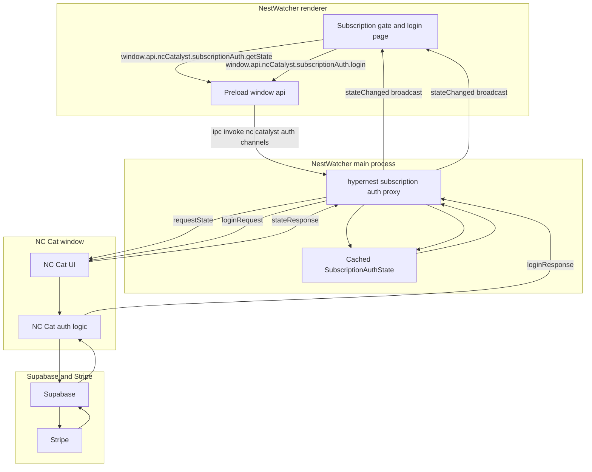

# NC Cat Supabase Auto Login and Seat Validation

This document explains how subscription login works in the current NestWatcher codebase.

Important scope note:
- NestWatcher does not call Supabase directly.
- NestWatcher opens or talks to an embedded NC Cat window.
- NC Cat is the thing that talks to Supabase and Stripe.
- NestWatcher gates features based on the `SubscriptionAuthState` it receives from NC Cat.

## The common state shape

The UI uses a shared type called `SubscriptionAuthState`.

It contains fields like:
- `authenticated` boolean
- `subscriptionStatus` string such as `active` or `grace_period`
- `isAdmin` boolean

In the renderer this state is managed by `SubscriptionAuthContext`.

## Current behavior in this repo

### Where the logic lives

- Main process proxy logic: `packages/main/src/ipc/hypernest.ts`
- Renderer gate: `packages/renderer/src/shell/SubscriptionGateLayout.tsx`
- Renderer state holder: `packages/renderer/src/contexts/SubscriptionAuthContext.tsx`
- Preload API surface: `packages/preload/src/index.ts`

### What happens at startup

- NestWatcher starts an NC Cat background window.
- Main asks NC Cat for the current auth state.
- If the operator is not authenticated, NestWatcher opens the NC Cat login UI.

### How login is requested

- The NestWatcher renderer calls `window.api.ncCatalyst.subscriptionAuth.login`.
- Main forwards the request to the NC Cat window.
- NC Cat performs the Supabase login and seat checks.
- NC Cat sends a login response back to Main.
- Main caches the state and broadcasts it to all renderer windows.

## Data flow diagram

A matching `.mmd` copy exists in `docs/charts/NC-CAT-SUPABASE-AUTO-LOGIN.mmd`.

## How the gate decides access

NestWatcher uses a gate layout to decide whether to show the real app or an auth required page.

- If `VITE_REQUIRE_SUBSCRIPTION_AUTH` is false, it only checks `authenticated`.
- If it is true, it checks `subscriptionStatus` is `active` or `grace_period`.
- If `isAdmin` is true, the gate is always satisfied.
