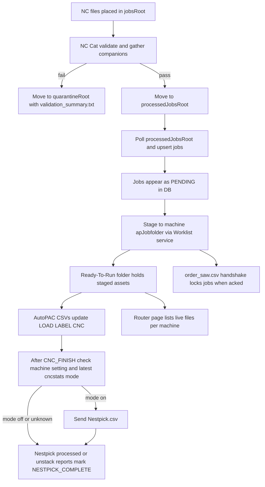

# Operations Guide (Condensed)

Audience: operators, support, and anyone tracing job/file movement. This replaces WATCHERS, WORKLIST, Job Files, and the old User Manual.

## Quick lifecycle
- Statuses (ordered): `PENDING` → `STAGED` → `LOAD_FINISH` → `LABEL_FINISH` → `CNC_FINISH` → `FORWARDED_TO_NESTPICK` → `NESTPICK_COMPLETE`.
- `FORWARDED_TO_NESTPICK` is conditional. When Nestpick mode is off for a CNC finish event, jobs complete without entering `FORWARDED_TO_NESTPICK`.
- `PENDING` is the intake state; leaving it clears the pre-reserve flag. Locks also clear at `NESTPICK_COMPLETE`.
- Full step-by-step timeline remains in `docs/JOB-FLOW.md`.

## Core folders (Settings)
- `jobsRoot`: where raw NC jobs arrive; NC Cat validation happens here.
- `processedJobsRoot`: validated jobs live here; ingest poller creates/updates DB rows from `.nc` after stability checks.
- `quarantineRoot`: failed validation is moved here with `validation_summary.txt`.
- `archiveRoot`: final archive for completed jobs.
- `autoPacCsvDir`: AutoPAC status CSVs; optional `archieve` subfolder for processed files when archiving is enabled.
- `machines[].apJobfolder`: Ready-To-Run target for staged jobs.
- `machines[].nestpickFolder`: where `Nestpick.csv` is written and processed/unstack reports are read; contains `processed` and `archive`.
- `machines[].nestpickEnabled`: disables Nestpick send/watch when false.
- `grundnerFolderPath`: handshake folder for order saw and stock sync; optional `archieve` for `.erl` replies when enabled.
- `jobsRoot`/`processedJobsRoot` watcher backoff: starts at 7.5s, doubles, max 240s; probes run with `stat` to recover share handle issues.

## High-level flow

## Staging rules (Worklist service)
- Modes:
  - **Planit**: `.lpt` present (no `.pts`). Copies `.lpt`, `<base>.csv`, family CSV `<prefix>.csv` (first 3 letters), resolves label images via CSV mapping; does not overwrite an existing family CSV in destination.
  - **Alphacam**: `.pts` present. Copies `.pts` and any images that start with the NC base.
  - **Generic**: neither `.lpt` nor `.pts`; copies NC and images that share the base prefix.
- Always copies `<base>.nc`, `<base>.csv` when present, and any `base*.bmp|jpg|jpeg`.
- Staging can optionally re-validate via NC Cat; errors block staging.
- Successful staging sets status `STAGED`, records a `worklist:staged` event, and can kick off Grundner order saw and Nestpick forwarding.
- Stage sanity poller: if a `STAGED` job loses its NC in `apJobfolder`, it reverts to `PENDING`.

## File expectations (short version)
- **NC**: `.nc` under `processedJobsRoot/<jobFolder>/`. Job key = relative folder plus base name.
- **Nestpick payload**: `.nsp` under the same folder, with legacy `.npt` still accepted. Payload is copied as-is and renamed to `Nestpick.csv` on send. Missing payload logs a warning but does not block staging.
- **Parts lists**: `.pts` (Alphacam) or `.lpt` (Planit) enable mode detection and part counting.
- **Project CSVs**: `<base>.csv` always copied; Planit also uses `<prefix>.csv` for image mapping.
- **Images**: any `base*.bmp|jpg|jpeg` copied; Planit may add images found via family CSV or `<base>.txt` mapping.

## AutoPAC status CSVs
- Location: `autoPacCsvDir`.
- Names: `load_finish<machine>.csv`, `label_finish<machine>.csv`, `cnc_finish<machine>.csv`.
- Validation: must contain commas or semicolons; at least two columns; machine token from filename must appear inside the file; column 1 supplies the base name (with or without `.nc`).
- On success: sets `LOAD_FINISH` / `LABEL_FINISH` / `CNC_FINISH`, then archives or deletes the CSV based on settings.
- On `CNC_FINISH`: if machine Nestpick is enabled and latest `cncstats.custom_values` for that machine says Nestpick mode on, send `Nestpick.csv`; otherwise complete job without forwarding.

## Nestpick
- Send: after `CNC_FINISH`, NestWatcher sends `Nestpick.csv` only when machine setting is enabled and latest `cncstats` Nestpick mode is on for that machine.
- Payload handling: source `.nsp` or legacy `.npt` is copied as-is and written as `Nestpick.csv` in `machines[].nestpickFolder`.
- Completion: watcher reads `processed/*.csv` and `Report_FullNestpickUnstack.csv`, marks `NESTPICK_COMPLETE`, updates pallet/source place, then moves reports into `archive`.
- If Nestpick is disabled for a machine, send/watch steps are skipped.

## Grundner interactions
- **Order saw**: staging writes `order_saw.csv` in `grundnerFolderPath`; waits for `order_saw.erl`. If content matches, jobs are locked and a confirmation event is recorded; `.erl` is deleted after checking. Busy signals (existing `ChangeMachNr.csv` or `.tmp`) trigger backoff retries.
- **Stock sync**: poller writes `stock_request.csv`, imports `stock.csv` replies into `public.grundner`, and refreshes Grundner/Allocated views.

## Sanity and cleanup
- Stage sanity: ensures staged NC still exists in `apJobfolder`; if missing, revert to `PENDING`.
- Source sanity: ensures `PENDING` jobs still have their NC in `processedJobsRoot`; deletes DB row only after 3 consecutive missing scans and resyncs Grundner pre-reserved counts.
- Archive queue: uses exponential backoff (cap 30s) to avoid losing files on flaky shares.

## Operator quick actions (UI)
- **Jobs page**: search/filter, pre-reserve/lock while `PENDING`, stage to a machine (creates re-run if already staged elsewhere), open history drawer.
- **Router**: live view of files in Ready-To-Run folders; supports auto-refresh, CSV export, clear processed view, delete selected assets.
- **History**: completed jobs timeline and optional re-run.
- **Grundner / Allocated / Ordering**: inventory view, allocations, and ordering comments; reflects stock sync and locks.
- **Telemetry / CNC Alarms**: summaries from external cncstats collector; map machines by `pcIp`.

## Troubleshooting checklist
- Job never appeared: confirm `processedJobsRoot` path and that `.nc` exists; ingest waits for file stability before DB upsert, then verify `jobs.key` matches folder/base.
- Status stuck before CNC: verify AutoPAC CSV naming/content and machine token; confirm archiving setting is correct.
- Nestpick missing: ensure `.nsp` exists at staging time for the job base (legacy `.npt` also works), machine Nestpick is enabled, and latest `cncstats.custom_values` Nestpick mode for that machine is on at CNC finish time.
- Locks/reserves not clearing: remember lock only applies in `PENDING`; it is cleared automatically at `NESTPICK_COMPLETE`.
