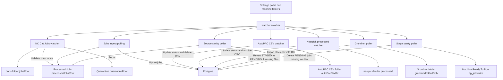

## File Watchers, AutoPAC, Nestpick, and Validation

This document explains the background watcher worker in plain English.

### Where the logic runs

- Worker: `packages/main/src/workers/watchersWorker.ts`
  - Watches folders on disk
  - Parses CSV files from external systems
  - Updates job status in Postgres
  - Forwards parts CSVs to Nestpick

Important: CNC telemetry is written directly to PostgreSQL by an external cncstats collector service. The watcher worker does not ingest telemetry.

---

## The big picture flow

A matching `.mmd` copy exists in `docs/charts/WATCHERS.mmd`.

---

## 1. NC Cat Jobs watcher

**What it watches**
- Folder: `jobsRoot`
- It reacts to new `.nc` files.
- Nesting depth: up to 10 folders deep under `jobsRoot`.

**What it does**
- Groups the `.nc` file into a "job folder" unit.
  - If the NC is already inside a folder, it treats that folder as the job.
  - If the NC is loose, it creates a timestamped folder name and gathers related files.
- Waits until the folder contents stop changing.
- Sends NC file contents to NC Cat headless validation.
- If validation has errors:
  - Move folder to `quarantineRoot` and write `validation_summary.txt`.
- Otherwise:
  - Move folder to `processedJobsRoot`.
  - Trigger ingest so the job appears quickly in the UI.

---

## 2. Jobs ingest polling

**What it scans**
- Folder: `processedJobsRoot`
- Interval: every few seconds.

**What it does**
- Walks the folder tree and finds `.nc` files.
- Builds a job key from folder plus base file name.
- Inserts or updates rows in `public.jobs`.
- Sets `pre_reserved = true` for newly inserted jobs.

This is what makes jobs show up as `PENDING`.

---

## 3. AutoPAC CSV watcher

**What it watches**
- Folder: `autoPacCsvDir`
- It reacts to new or changed `.csv` files.

**File naming must include the machine token**
- `load_finish<machine>.csv`
- `label_finish<machine>.csv`
- `cnc_finish<machine>.csv`

**What it does**
- Waits for the file to stabilize.
- Reads and parses the CSV.
- Verifies the machine token in the filename also appears somewhere inside the CSV.
- Extracts job base names from column 0.
- Updates each matching job to `LOAD_FINISH`, `LABEL_FINISH`, or `CNC_FINISH`.
- Deletes the CSV after successful processing.

On `CNC_FINISH`, it can also trigger Nestpick forwarding.

---

## 4. Nestpick watchers

**Processed watcher**
- Folder: `machine.nestpickFolder/processed`
- When a CSV arrives, it reads the job names inside and updates jobs to `NESTPICK_COMPLETE`.
- Then it moves that CSV into `machine.nestpickFolder/archive`.

**Unstack report watcher**
- Folder: `machine.nestpickFolder`
- File: `Report_FullNestpickUnstack.csv`
- Used to update the `pallet` field for jobs.

---

## 5. Grundner poller

**What it watches**
- Folder: `grundnerFolderPath`
- It polls on an interval.

**What it does**
- Writes a request file `stock_request.csv`.
- Waits for Grundner to write `stock.csv`.
- Imports `stock.csv` into `public.grundner`.
- Triggers renderer refresh for Grundner and allocated material pages.

---

## 6. Sanity pollers

These are safety nets.

**Stage sanity poller**
- Looks for jobs marked `STAGED` in the DB.
- Verifies the NC file still exists in the machine Ready To Run folder.
- If missing, it reverts the job back to `PENDING` and logs an event.

**Source sanity poller**
- Looks for jobs with status `PENDING` in the DB.
- Verifies the NC file still exists in `processedJobsRoot`.
- If missing, it deletes the job row and resyncs the Grundner pre reserved count.
