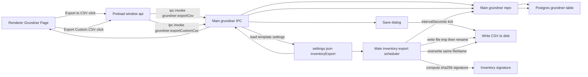

# Grundner Inventory Export Data Flow

```mermaid
flowchart LR
  UI[Renderer Grundner Page]
  PRE[Preload window api]
  IPC[Main grundner IPC]
  REPO[Main grundner repo]
  DB[Postgres grundner table]
  DLG[Save dialog]
  FILE[Write CSV to disk]

  UI -->|Export to CSV click| PRE
  PRE -->|ipc invoke grundner:exportCsv| IPC
  IPC --> REPO --> DB
  IPC --> DLG --> FILE
  IPC --> UI

  UI -->|Export Custom CSV click| PRE
  PRE -->|ipc invoke grundner:exportCustomCsv| IPC
  IPC -->|load template settings| CFG[settings json inventoryExport]
  IPC --> REPO

  CFG --> IPC

  SCHED[Main inventory export scheduler]
  CFG --> SCHED
  SCHED -->|intervalSeconds tick| REPO
  SCHED -->|compute sha256 signature| HASH[Inventory signature]
  REPO --> DB
  SCHED -->|write file tmp then rename| FILE
  SCHED -->|overwrite same fileName| FILE
```
