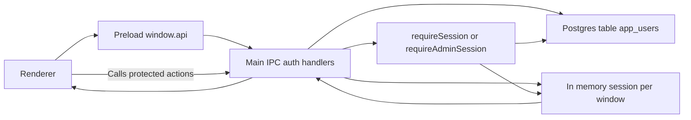

# User Accounts & Authentication

## Why we added accounts
- Every workstation shares the same database, so we need to attribute who staged jobs, locked sheets, or marked materials ordered.
- Admins should be the only operators who can change installation-wide settings (DB credentials, machine configs, etc.).
- If a workstation is left unattended, we want a lightweight login barrier the next time the app launches.

All of this happens entirely on the customer’s network—no cloud service or internet calls are involved.

## Database schema (`public.app_users`)
| Column | Purpose |
| --- | --- |
| `username` | Unique login identifier (case-insensitive). |
| `display_name` | Friendly name we show in the UI and activity logs. |
| `password_hash` | Argon2-style hash (salted via Node `scrypt`). |
| `security_*_hash` | Hashes for the three security answers (pet, mother’s maiden name, first school). |
| `role` | `admin` or `operator`; defaults to `operator`. Admins unlock Settings. |
| `force_password_reset`, `failed_attempts` | Enforce the “5 failed logins → reset required” rule. |
| `active_session_token` | Ensures a user can only be signed in on one workstation at a time. |
| Timestamps | Track when the account was created/updated or last logged in. |

We also added `locked_by` and `staged_by` columns on `public.jobs` so locks/stages reflect the authenticated user instead of the OS username.

## Authentication flow
1. **App launch** – The renderer mounts `AuthProvider`; it calls `auth:me`. If no session is present, the login modal opens and blocks the rest of the UI.
2. **Register** – Collects username, display name, password, and three security answers. Answers and password are hashed before inserting a row. Registration logs the user in immediately.
3. **Login** – Username/password are validated against the stored hash. We track failed attempts; the 5th failure sets `force_password_reset = true` and forces the reset flow.
4. **Forgot password** – Enter username, answer any two of the three security questions, and choose a new password. On success, we clear failed attempts and sign the user in.
5. **Sessions** – On successful login/register/reset the backend issues a UUID token, records it in the DB, and keeps it in memory for that renderer window. The token is never persisted to disk, so reopening the app always re-prompts.
6. **Logout** – Clears the DB token and the renderer session; the login modal reopens.

## Data flow diagram

This diagram shows the actual request path for local authentication and why it is safe.

A matching `.mmd` copy exists in `docs/charts/user-auth.mmd`.

## Role enforcement
- The main process knows the current session for each `WebContents`. All privileged IPC handlers call `requireSession` or `requireAdminSession`.
  - Settings (read/save/test DB) now require admin.
  - Ordering updates, job locking/staging, etc. require any authenticated user (session is required for almost every mutation call).
- In the renderer, the Settings button only renders when `session.role === 'admin'`.

## Activity attribution
- `lockJob`, `unlockJob`, staging flow, and ordering comments all receive the authenticated display name from the IPC handler.
- Messages such as “Jobs Locked” or “Job Staged” include `userSuffix`, so the feed reads e.g. “Locked 2 jobs… (by Josh)”.
- Jobs table shows who locked or staged a row (small grey text under the “Locked” column and STAGED badge).
- Ordering page uses the authenticated display name rather than `os.userInfo()`.

## Security questions
- Stored as hashes in the same table as the user; no plaintext answers exist after registration.
- Reset flow requires matching at least two answers (hence three fields: first pet, mother’s maiden name, first school).
- Because the app is offline, this gives us a simple identity check without email or SMS.

## Manual admin setup
- There is no UI for promoting users; set `role = 'admin'` manually using pgAdmin/psql for the first account on a customer site.
- Subsequent installs can reuse the same DB row; just remind the customer to change the default password.

## Things to remember
- Since sessions are in-memory only, every app restart requires a login (as requested).
- Password hashes use Node’s `crypto.scrypt`; tweak `KEY_LENGTH` or swap to Argon2 if we ever introduce a native addon.
- If the login modal is closed without an active session, the rest of the app stays blank—users must authenticate to interact with any page.

With these pieces in place, every sensitive action (settings, staging, locking, ordering) ties back to a specific operator, and admins can trust that only they can change global configuration.***
